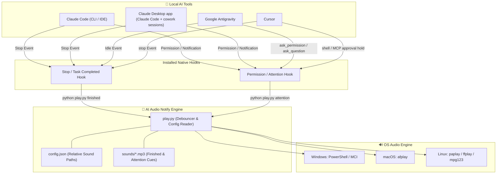

<div align="center">

# 🔔 AI Audio Notify

**Instant drop-in audio cues for Claude Code, the Claude Desktop app, Cursor, and Google Antigravity.**

*Stay in your flow state — hear when your AI agent finishes working or needs your green light.*

[](LICENSE)
[](https://www.python.org/)
[]()
[-success.svg)]()
[](https://github.com/VihaanMa11/ai-audio-notify/pulls)

---

[What is this?](#-what-is-this) • [Architecture](#-how-it-works) • [Quick Start](#-quick-start) • [Supported Tools](#-supported-ai-tools) • [Custom Audio](#-custom-audio--voice-packs) • [Troubleshooting](#-troubleshooting)

</div>

---

## 📖 What is AI Audio Notify?

**AI Audio Notify** is a lightweight, zero-dependency background notification tool designed for developers who use AI coding assistants like **Claude Code**, the **Claude Desktop app** (Claude Code & cowork sessions), **Cursor**, and **Google Antigravity**.

### ❌ The Problem
When working with autonomous AI agents:
- Agents take anywhere from **10 seconds to several minutes** to complete multi-file edits, run tests, or execute terminal commands.
- Developers constantly **alt-tab** back and forth or stare at terminal outputs just to check if the AI finished.
- When an agent gets blocked on a **permission prompt** or **user question**, it sits idle until you notice.

### ✅ The Solution
**AI Audio Notify** automatically registers native hooks with your AI tools to play distinct, non-intrusive sound cues:
- 🟢 **Task Finished Sound**: Plays the exact instant the AI finishes its work and returns control to you.
- 🟡 **Needs Attention Sound**: Plays when the AI requests permission, tool execution approval, or user clarification.

---

## ⚡ Key Highlights & Features

- 🪶 **Zero Background Daemons**: Runs purely on-demand via event hooks. Uses 0% CPU and 0MB RAM while waiting.
- 🔒 **100% Private & Offline**: Runs locally standard library Python. No internet required, no telemetry, no tracking.
- 📦 **Zero External Dependencies**: No `pip install`, no `npm`, no heavy audio libraries. Works out of the box with OS native players (`afplay` on macOS, `PowerShell` on Windows, `ffplay`/`paplay` on Linux).
- 🛡️ **Fail-Open Architecture**: Execution never blocks your AI agent. If audio fails for any reason, the agent continues normally.
- ⏱️ **Smart Debouncing**: Built-in event debouncer prevents double-triggering when multiple hooks fire simultaneously.
- 🎧 **Fully Customizable**: Swap default voice prompts with custom spoken lines (ElevenLabs, OpenAI TTS) or sound effects (pings, chimes).

---

## 🔄 How It Works (Architecture)



---

## 🔊 Audio Cue Matrix

| Cue | Trigger Event | Default Included Voice Sound |
| :--- | :--- | :--- |
| 🟢 **Finished** | Agent task / loop finished execution | [`sounds/task-finished.mp3`](sounds/task-finished.mp3) ("Task complete") |
| 🟡 **Attention** | Agent blocked on permission / user input prompt | [`sounds/needs-attention.mp3`](sounds/needs-attention.mp3) ("Input needed") |

---

## 🤖 Supported AI Tools

| AI Tool | Finished Cue | Attention Cue | Integration Mechanism |
| :--- | :---: | :---: | :--- |
| **Claude Code** | ✅ | ✅ | `Stop` & `Notification` hooks in `~/.claude/settings.json` |
| **Claude Desktop app** | ✅ | ✅ | Shares the same `~/.claude/settings.json` hooks — desktop Claude Code & cowork sessions run on the Claude Code engine |
| **Google Antigravity** | ✅ | ✅ | `Stop` & `PreToolUse` hooks in `~/.gemini/config/hooks.json` |
| **Cursor** | ✅ | ✅ | `stop` (finished) + `beforeShellExecution` / `beforeMCPExecution` (attention hold) in `~/.cursor/hooks.json` |

> **Cursor hold note:** When the agent is about to run a shell or MCP tool, you hear the **attention** cue and get an approval prompt (`cursor_permission_mode: "ask"` in `config.json`). Set that to `"allow"` if you only want the sound without forcing prompts.
> **Claude Desktop note:** The desktop app fires these hooks for its **Claude Code and cowork sessions** — you'll hear the attention cue when a session needs permission or has been waiting for your input, and the finished cue when it hands control back. Plain claude.ai chat conversations inside the desktop app don't expose local hooks, so those can't ring (use the app's built-in notification settings for them).

---

## 🚀 Quick Start

### 1. Clone the repository

```bash
git clone https://github.com/VihaanMa11/ai-audio-notify.git
cd ai-audio-notify
```

### 2. Run the automated installer

The installer scans your machine, detects installed AI tools, and configures native notification hooks automatically.

#### 🪟 Windows
Double-click `Install.bat` or run in PowerShell / CMD:
```powershell
.\Install.bat
```

#### 🍎 macOS / 🐧 Linux
```bash
chmod +x install.sh
./install.sh
```

#### 🐍 Python Direct (Any OS)
```bash
python install.py
```

### 3. Select tools to enable

When prompted, press `Enter` to auto-enable for all detected tools:

```text
==================================================
        AI Audio Notify — Installer
==================================================

Scanning local system for supported AI tools...

  [1] Claude Code        - DETECTED
  [2] Cursor             - DETECTED
  [3] Antigravity        - DETECTED

Select tools to install hooks into (default: ALL detected):
[Enter] Install all detected (1, 2, 3)
```

### 4. Test sound playback

Confirm audio playback works on your system:

```bash
python play.py finished
python play.py attention
```

> **Note:** Restart your active Claude Code / Cursor / Antigravity terminal or application sessions once after installation so they load the newly registered hooks.

---

## ⚡ Non-Interactive / Unattended Install

For automated dev environments, container setups, or scripts:

```bash
python install.py --tools claude,claude-desktop,cursor,antigravity --yes
```

---

## 🎧 Custom Audio & Voice Packs

Want to use your own voice lines or sound effects? You can swap sounds in 30 seconds without modifying code.

### Method 1: Drop-in File Swap (Simplest)

1. Get two short audio clips (~1–3 seconds long).
2. Overwrite the files in the `sounds/` directory:
   - `sounds/task-finished.mp3`
   - `sounds/needs-attention.mp3`
3. Test using `python play.py finished`. **No re-installation required!**

### Method 2: Custom Filenames & Paths

Add your custom audio files to `sounds/` and edit [`config.json`](config.json):

```json
{
  "sounds": {
    "finished": "sounds/my-custom-done.mp3",
    "attention": "sounds/my-custom-alert.mp3"
  },
  "debounce_ms": 400,
  "supported_tools": ["claude", "claude-desktop", "cursor", "antigravity"]
}
```

> ⚠️ Sound paths in `config.json` must remain relative to the repository root.

---

## 🎙️ Where to Generate Audio & AI Voices

| Source | Category | Description / Tips |
| :--- | :--- | :--- |
| **[ElevenLabs](https://elevenlabs.io)** | AI Voice (TTS) | High-quality realistic voice synthesis (e.g. *Antoni* or *Jarvis*). |
| **[OpenAI TTS](https://platform.openai.com)** | AI Voice (TTS) | Expressive voice presets (Alloy, Echo, Fable, Onyx, Nova, Shimmer). |
| **[Google Cloud TTS](https://cloud.google.com/text-to-speech)** | AI Voice (TTS) | Wide selection of Neural2 and Journey voices. |
| **macOS `say`** | Built-in TTS | Run `say -v Samantha "Task complete" -o finished.aiff` and convert to MP3. |
| **[Freesound](https://freesound.org)** | Sound Effects | Free CC audio library for UI chimes, bells, and notification pings. |
| **[Pixabay SFX](https://pixabay.com/sound-effects/)** | Sound Effects | Clean, royalty-free notification sound effect packs. |

### 💡 Suggested Prompts / Phrases
- **Finished:** *"Task complete."* • *"All done!"* • *"Ready for next step."* • *[Soft Chime]*
- **Attention:** *"Input needed."* • *"Permission required."* • *"Standing by for user."* • *[Ping Alert]*

See [`sounds/REPLACE.md`](sounds/REPLACE.md) for audio editing & volume tips.

---

## 📁 Repository Structure

```text
ai-audio-notify/
├── Install.bat           # Windows 1-click launcher
├── install.sh            # macOS / Linux 1-click launcher
├── install.py            # Main detector & CLI installer
├── uninstall.py          # Clean hook remover
├── play.py               # Debounced playback engine
├── config.json           # Active sound paths & debounce settings
├── sounds/
│   ├── task-finished.mp3 # Default finished audio cue
│   ├── needs-attention.mp3# Default attention audio cue
│   └── REPLACE.md        # Audio replacement instructions
├── lib/                  # Audio drivers & config mergers
│   ├── detect.py         # AI tool presence scanner
│   ├── merge_json.py     # Non-destructive JSON hook merger
│   └── platforms.py      # Cross-platform OS audio player bindings
└── adapters/             # Tool-specific adapter logic
    ├── claude.py         # Claude Code settings hook integration
    ├── claude_desktop.py # Claude Desktop app (shares Claude Code hooks)
    ├── cursor.py         # Cursor hooks configuration
    └── antigravity.py    # Google Antigravity hook integration
```

---

## 🛠️ Troubleshooting

| Problem | Root Cause | Resolution |
| :--- | :--- | :--- |
| `Python not found` on Windows | Python is missing from system PATH | Download [Python 3.9+](https://www.python.org/downloads/) and enable **"Add python.exe to PATH"**. |
| Silent on Windows | Missing MCI audio driver | `play.py` automatically falls back to PowerShell `MediaPlayer`. Check system volume and run `python play.py finished`. |
| No sound after agent run | Tool hooks haven't reloaded | Restart your Claude Code / Cursor / Antigravity session. Inspect `%TEMP%\ai-audio-notify\last-play.log` for logs. |
| Sound fires twice in a row | Debounce threshold too low | Increase `"debounce_ms"` in `config.json` (e.g. from `400` to `800`). |
| Tool shows "Not Found" | Tool is not installed on system | Install the AI tool, or skip it during interactive prompt. Download links are printed for missing tools. |

---

## 🧹 Uninstallation

To cleanly remove all hooks installed by this repository without disturbing your other personal tool settings:

```bash
python uninstall.py
```

---

## 📜 License

Distributed under the **MIT License**. See [`LICENSE`](LICENSE) for details. Feel free to fork, customize, swap voices, and share!

<div align="center">

**Enjoying AI Audio Notify? Give it a ⭐ on GitHub!**

</div>
